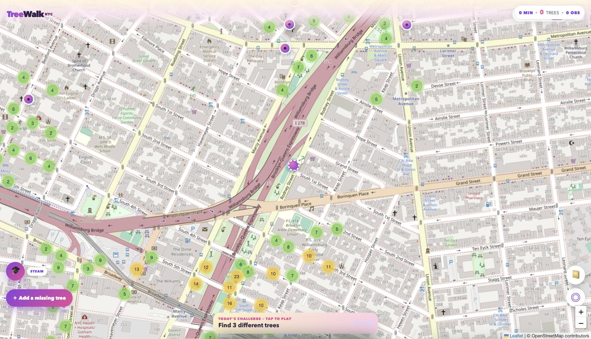
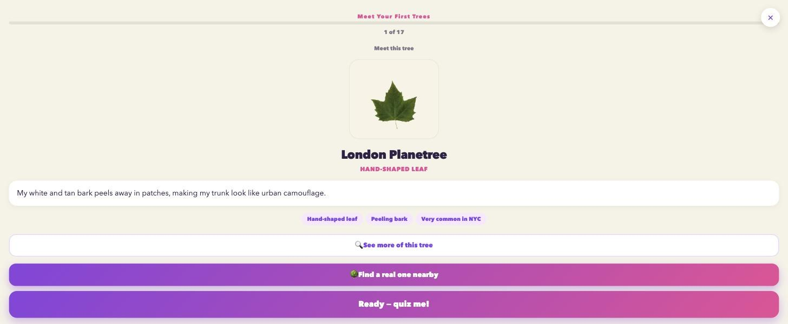
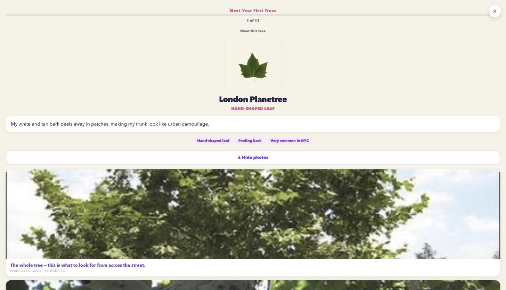

# TreeWalk NYC

TreeWalk turns a walk through New York City into a living map: find the real trees
around you, learn what they are, document them, and build a shared, growing record of
the city's urban forest. It ships in two modes from the same codebase — a **Community**
mode for general exploration, tree documentation, and tree-bed stewardship, and a
**Kids** mode built around a gamified STEAM curriculum for ages 6-11.

**Live app: https://superb-starship-196cd2.netlify.app/** — no install or signup
needed to explore the map.

<p>
  
  
  
</p>

> **Looking for a few contributors.** Specifically want to hear from people into
> **mapping**, **civic/open data**, **education content**, or **UX/accessibility** — four
> concrete starter issues, one per area, are open right now:
> [add a city](https://github.com/g20lab/treewalk-nyc/issues/1) ·
> [fix a data gap](https://github.com/g20lab/treewalk-nyc/issues/2) ·
> [add a species deep dive](https://github.com/g20lab/treewalk-nyc/issues/3) ·
> [keyboard accessibility](https://github.com/g20lab/treewalk-nyc/issues/4).
> See [CONTRIBUTING.md](CONTRIBUTING.md) for what "done" looks like on each.

## What's in here

- **Community mode** — geolocation-driven map of real NYC street trees (NYC Parks'
  live Forestry Tree Points dataset), marker clustering, tree detail sheets with
  species info, a "Missing Trees" mystery/find game, single- and multi-photo
  documentation, tree-bed sponsorship/funding, a shared care log, and account sync via
  Supabase.
- **Kids mode** — a per-species mastery curriculum: teach-then-quiz lesson flow, a
  one-species real-photo deep dive (whole tree, bark, fruit), and a "Leaf → Find It"
  bridge that sends a kid straight from a lesson into a live, targeted version of the
  map's find/guess game for the species they just learned.
- **Multi-city adapter pattern** (`cityAdapters.js`) — NYC and Philadelphia are wired
  up today; adding a city is a matter of writing one more adapter with the same
  `fetchTrees(lat, lng)` shape.
- A **printable curriculum** (`curriculum/`) — lesson plans, ID sheets, and coloring
  sheets per species, adapted from the NYC Parks Street Tree Identification Guide.

## Stack

Plain HTML/CSS/JS — no build step, no framework, no bundler. Scripts are loaded in
order as classic `<script>` tags sharing one global scope:

```
cityAdapters.js → curriculum.js → speciesDeepDive.js → app.js → kidsLessons.js
  → cloud-config.js → cloud-sync.js
```

Map rendering is [Leaflet](https://leafletjs.com/) + `leaflet.markercluster`, loaded
from a CDN. Accounts, tree records, photos, and social features (care log, reactions,
verification) are backed by [Supabase](https://supabase.com/) — see `cloud-sync.js`.
Offline/installability comes from a small service worker (`sw.js`) with a network-first
caching strategy, so a fresh deploy is always picked up on next load rather than served
stale.

## Running it locally

There's no build step — it's static files. Serve the folder over HTTP and open it:

```
python3 -m http.server 8080
```

Then visit `http://localhost:8080`. Geolocation requires HTTPS on a real device/host
(browsers block it on plain HTTP except `localhost`), so a real deployment (Netlify,
Vercel, GitHub Pages, etc.) is needed to test location features on a phone.

### Backend (optional)

Community-mode accounts, cloud-synced trees/photos, and social features need a
Supabase project. `cloud-config.js` holds the project URL and a publishable
(anon/public) key — safe to be client-side by design, since Supabase enforces access
with Row Level Security policies, not by keeping that key secret. To run your own
backend, point `cloud-config.js` at your own Supabase project and apply the schema
(migrations aren't included in this repo yet — see "Contributing" below). Without a
configured backend, Community mode's map/discovery features still work against live
public tree data; only accounts, sync, and social features need it.

## Data sources

- **NYC** — [NYC Parks Forestry Tree Points](https://data.cityofnewyork.us/Environment/Forestry-Tree-Points/hn5i-inap)
  (continuously maintained), via NYC Open Data's Socrata API.
- **Philadelphia** — [Philadelphia Parks & Recreation tree inventory](https://www.opendataphilly.org/),
  via an ArcGIS FeatureServer.
- **Species content** adapted from NYC Parks' *Street Tree Identification Guide*.

## Contributing

This project is young and moves fast — expect some rough edges (a couple of features
in `app.js`/`kidsLessons.js` are mid-build, and there's no automated test suite yet).
Issues and PRs are welcome — see [CONTRIBUTING.md](CONTRIBUTING.md) for how to run it
locally, what a good first PR looks like, and the ground rules for adding a city or a
species.

## License

MIT — see [LICENSE](LICENSE).
